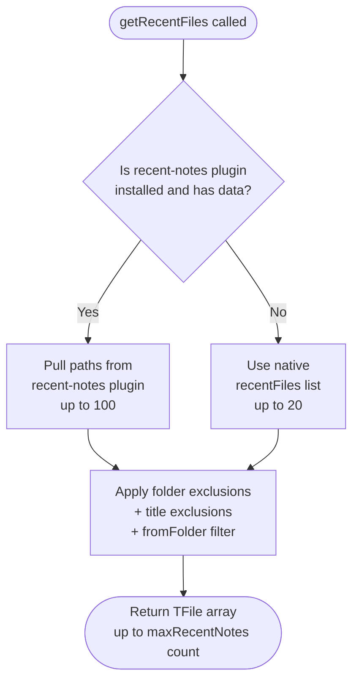

# 📘 Recent Notes for Dataview — Complete 1:1 Tutorial
---


---

> **GitHub:** [Recent Note Dataview](https://github.com/sujit-waghmare/recent-notes-dataview)
> **Version:** 1.4.0
> **Visibility:** Public Plugin
> <cite>Waghmare</cite>

---

## 📦 STEP 1: Prerequisites

Before anything, make sure you have these plugins installed in Obsidian:

**Required:**
1. **[Dataview](obsidian://show-plugin?id=dataview)** — search it in Community Plugins and install it
2. **[Recent Notes for Dataview](https://github.com/sujit-waghmare/recent-notes-dataview)** — this is the plugin we built (manual install until community store approval)

**Optional but highly recommended (unlocks 100 recent notes):**
3. [Recent Notes](obsidian://show-plugin?id=recent-notes) by [Kamil Rudnicki](https://github.com/kamil-rudnicki) — search `Recent Notes` in Community Plugins

To install community plugins:
> Obsidian → Settings → Community Plugins → Turn off Restricted Mode → Browse

> [!tip] **Why install "Recent Notes" by Kamil Rudnicki?**
> Our plugin can read its internal list of up to 100 recently opened notes. Without it, our native tracker caps at 20. With it, the slider goes all the way to 100.

---

## 🗂 STEP 2: Manual Installation of the Plugin

Since this plugin is not on the community store yet, install it manually from [GitHub](https://github.com/sujit-waghmare/recent-notes-dataview).

### Folder structure you need:

```
YourVault/
    └── .obsidian/
            └── plugins/
                    └── recent-notes-dataview/
                            ├── main.js
                            ├── manifest.json
                            └── styles.css
```

> [!important] `styles.css` is required from v1.3.0 onwards. All three files must be present.

### Steps:

1. Open your vault folder on your computer
   - Windows: Right-click vault in Obsidian → "Open vault folder"
   - Mac/Linux: Same option in File menu
2. Navigate to `.obsidian/plugins/`
   - If `plugins/` folder doesn't exist, create it manually
3. Create a new folder named exactly: `recent-notes-dataview`
4. Paste `main.js`, `manifest.json`, and `styles.css` inside it
5. Open Obsidian
6. Go to **Settings → Community Plugins**
7. Click the **Refresh** button (circular arrow icon)
8. Find **"Recent Notes for Dataview"** in the list
9. Toggle it **ON**

✅ You should see a brief notice if Dataview is missing, or nothing if all is good.

---

## 🔌 STEP 3: Unlocking 100 Recent Notes *(New in v1.4.0)*

This is the biggest new feature in v1.4.0. Here's how it works:

### Option A — With "Recent Notes" plugin (recommended)

1. Go to **Settings → Community Plugins → Browse**
2. Search for **"Recent Notes"** — install the one by **Kamil Rudnicki**
3. Enable it
4. Go to **Settings → Recent Notes for Dataview**
5. You will see a **green banner**: ✅ Recent Notes plugin detected — up to 100 recent notes available
6. The slider now goes from **5 to 100**
7. Your DataviewJS query automatically pulls from its list — no snippet change needed

### Option B — Without "Recent Notes" plugin (native fallback)

- Our plugin tracks notes natively on its own
- Max display is **20 notes** (slider 5–20)
- You will see an **orange banner**: ⚠ Recent Notes plugin not found — using native tracking (max 20 notes)
- The orange banner also hints to install the plugin to unlock more

### How the priority works internally



---

## ⚙️ STEP 4: Plugin Settings

Go to:
> Settings → (scroll down) → Recent Notes for Dataview

You will see **four sections** in v1.4.0:

---

### 🔢 Section 1: Number of Recent Notes

- A **slider** that adjusts dynamically based on which plugins you have installed:
  - **With** "Recent Notes" plugin → slider range: **5 to 100**
  - **Without** "Recent Notes" plugin → slider range: **5 to 20**
- Changes apply **instantly**, no restart needed
- Default is **5**

Examples:
  - Slider at 5 → shows your last 5 opened notes
  - Slider at 20 → shows your last 20 opened notes
  - Slider at 100 → shows all 100 recent notes (requires Recent Notes plugin)

---

### 🚫 Section 2: Excluded Folders

Block entire folders from being tracked. Notes inside excluded folders never appear in Dataview queries.

#### How to add a folder:

1. Click the input box under "Excluded folders"
2. Start typing a folder name — it **autocompletes** from your vault
   - e.g. type `Pri` → suggests `Private`
3. Select or finish typing the full path
   - Single folder:   `Private`
   - Nested folder:   `Work/Drafts`
   - Deep path:       `Resources/Templates/Daily`
4. Click **Add folder** or press **Enter**
5. The folder appears in the list below with a 📁 icon

#### How to remove a folder:

1. Find the folder in the list
2. Click the **Remove** button on the right
3. That folder's notes will immediately start appearing again

#### Clear all at once:

- If you have 2 or more excluded folders, a **"Clear all excluded folders"** button appears below the list
- Click it to remove all exclusions in one go

#### Important rules about folder exclusion:

- Exclusion is **recursive** — blocking `Private` also blocks:
  - `Private/Journal/`
  - `Private/Archive/2024/`
  - `Private/anything/deeply/nested/`
- If you open a note inside an excluded folder, it is **silently ignored** — nothing happens, no error
- If you add a folder to exclusions AFTER some of its notes were already tracked, those notes **disappear from the Dataview table immediately** — no restart needed
- Folder paths are **case-sensitive** on Mac/Linux — `private` ≠ `Private`

---

### 🔤 Section 3: Excluded Titles

Block notes by their **filename** using text-based rules. Two modes are available:

#### Mode 1 — Contains (default)

Hides any note whose filename **contains** the text you type.

Example: typing `Untitled` hides:
- `Untitled.md`
- `Untitled 1.md`
- `Untitled 23.md`
- `My Untitled Draft.md`

#### Mode 2 — Exact match

Hides only notes whose filename **exactly equals** the text you type (case-insensitive).

Example: typing `Meeting` with exact match ON hides:
- `Meeting.md` ✅

But does **NOT** hide:
- `Team Meeting.md` ❌
- `Meeting Notes.md` ❌

#### How to add a title filter:

1. Type the text in the input box (e.g. `Untitled`)
2. Check the **Exact match toggle**:
   - Toggle OFF (default) → Contains mode
   - Toggle ON → Exact match mode
3. Click **Add filter** or press **Enter**
4. The filter appears in the list with a badge:
   - `🔤 Untitled [contains]`
   - `🔤 Meeting [exact]`

#### How to remove a title filter:

1. Find the entry in the list
2. Click **Remove** — notes matching that filter reappear immediately

#### Important rules about title exclusion:

- Matching is always **case-insensitive** — `untitled` matches `Untitled`
- The `.md` extension is stripped before matching — you never need to include it
- Title exclusion applies **on top of** folder exclusion — both rules are active at all times
- A note already tracked before you added a title filter will **disappear from Dataview immediately** after adding it — no restart needed

---

### 📋 Section 4: DataviewJS Snippets

At the bottom of settings, two ready-to-use code blocks are available, each with a **Copy** button.

**Snippet 1 — Basic** (shows all recent notes, respects all exclusions)

**Snippet 2 — Folder-filtered** (shows recent notes only from a specific folder)

---

## 📝 STEP 5: Using the Dataview Query

### 5.1 — Basic snippet

In any note, create a `dataviewjs` code block and paste this:

~~~
```dataviewjs
// ── Recent Notes (powered by Recent Notes for Dataview) ──
const rn = app.plugins.plugins["recent-notes-dataview"];
if (!rn) { dv.paragraph('⚠ Plugin not enabled.'); }
else {
  const files = rn.getRecentFiles();
  if (files.length === 0) {
    dv.paragraph("No recent notes yet — open a few notes first!");
  } else {
    dv.table(["Note", "Modified", "Folder"],
      files.map(f => [
        dv.fileLink(f.path),
        new Date(f.stat.mtime).toLocaleString(),
        f.parent?.path || "/"
      ])
    );
  }
}
```

### 5.2 — Folder-filtered snippet

Show recent notes only from a **specific folder** using the `fromFolder` option:

```dataviewjs
// ── Recent Notes from a specific folder ──
const rn = app.plugins.plugins["recent-notes-dataview"];
if (!rn) { dv.paragraph('⚠ Plugin not enabled.'); }
else {
  // Change "Templates" to any folder path you want
  const files = rn.getRecentFiles({ fromFolder: "Templates" });
  if (files.length === 0) {
    dv.paragraph("No recent notes in this folder.");
  } else {
    dv.table(["Note", "Modified"],
      files.map(f => [
        dv.fileLink(f.path),
        new Date(f.stat.mtime).toLocaleString()
      ])
    );
  }
}
```
~~~

You can use any folder path in `fromFolder`:

| Example | What it shows |
|---|---|
| `{ fromFolder: "Templates" }` | Recent notes only from `Templates/` |
| `{ fromFolder: "Work/Projects" }` | Recent notes only from `Work/Projects/` |
| `{ fromFolder: "Daily Notes" }` | Recent notes only from `Daily Notes/` |
| *(no option)* | All recent notes from the whole vault |

### 5.3 — Numbered list of up to 100 recent notes *(New in v1.4.0)*

Works automatically when [Recent Notes](obsidian://show-plugin?id=recent-notes) by Kamil Rudnicki is installed and slider is set high:

```dataviewjs
// ── All Recent Notes with row numbers ──
const rn = app.plugins.plugins["recent-notes-dataview"];
if (!rn) { dv.paragraph('⚠ Plugin not enabled.'); }
else {
  const files = rn.getRecentFiles();
  if (files.length === 0) {
    dv.paragraph("No recent notes yet.");
  } else {
    dv.paragraph(`Showing ${files.length} recent notes:`);
    dv.table(["#", "Note", "Modified", "Folder"],
      files.map((f, i) => [
        i + 1,
        dv.fileLink(f.path),
        new Date(f.stat.mtime).toLocaleString(),
        f.parent?.path || "/"
      ])
    );
  }
}
```

> [!tip] Set the slider to 100 in Settings to show all available notes. The `#` column numbers each row so you can see exactly how many notes are being shown.

### 5.4 — What the table shows

| Column | What it displays |
|--------|-----------------|
| # | Row number (optional, from 5.3 snippet) |
| Note | Clickable link to the note |
| Modified | Last modified date & time |
| Folder | The folder the note lives in |

### 5.5 — Where to put this snippet

Good places to use it:

- Your **Dashboard** note (home page of your vault)
- A **MOC** (Map of Content) note
- Your **Daily Note** template
- A dedicated **"Recent"** note pinned in your sidebar

---

## 🧪 STEP 6: Testing It Works

Follow this exact sequence to verify everything is working:

1. Make sure the plugin is enabled (Step 2)
2. Open 6–8 different notes in your vault by clicking them
3. Go to the note where you pasted the DataviewJS snippet
4. You should now see a table listing those recently opened notes
5. Click any note link in the table — it should navigate to that note

If the table says **"No recent notes yet"** — just open a few more notes first and come back.

---

## 🔌 STEP 7: Testing the 100-Note Integration *(New in v1.4.0)*

1. Install [Recent Notes](obsidian://show-plugin?id=recent-notes) by Kamil Rudnicki from Community Plugins and enable it
2. Open **Settings → Recent Notes for Dataview**
3. Confirm the **green banner** appears: ✅ Recent Notes plugin detected
4. Confirm the slider maximum is now **100**
5. Open 10+ different notes across your vault
6. Set the slider to 10 or more
7. Go to your Dataview note — you should see the full list populated

To confirm the source is the external plugin and not native tracking:
- Open a note you opened before installing our plugin
- If it appears in the table, the external plugin's history is being used ✅

---

## 🚫 STEP 8: Testing Folder Exclusion

1. Go to **Settings → Recent Notes for Dataview**
2. Add a folder you use often — e.g. `Daily Notes`
3. Open 2–3 notes from inside that folder
4. Go back to your Dataview note
5. Those notes should **NOT** appear in the table
6. Open a note from a non-excluded folder
7. It should appear in the table normally

To test "retroactive exclusion":
1. Open several notes from folder `Work`
2. Verify they show up in the table
3. Now go to Settings and add `Work` to excluded folders
4. Go back to the Dataview note — the `Work` notes should vanish immediately

---

## 🔤 STEP 9: Testing Title Exclusion

#### Testing Contains mode:

1. Create a note named `Untitled 1` and open it
2. Go to Settings → add title filter `Untitled` with exact match **OFF**
3. Go back to your Dataview note
4. `Untitled 1` should not appear in the table
5. Create a note named `My Project` and open it
6. `My Project` should appear normally — it doesn't contain `untitled`

#### Testing Exact match mode:

1. Create two notes: `Meeting` and `Team Meeting` — open both
2. Go to Settings → add title filter `Meeting` with exact match **ON**
3. Go back to your Dataview note
4. `Meeting` should be hidden ✅
5. `Team Meeting` should still appear ✅ — exact match only blocks the full title

---

## ❌ STEP 10: Troubleshooting

### Problem: Table doesn't appear at all
- Make sure the **Dataview** plugin is installed and enabled
- Check that you used ` ```dataviewjs ` (not ` ```dataview `)
- The plugin ID in the code must be exactly: `"recent-notes-dataview"`

### Problem: "⚠ Plugin not enabled" message
- Go to Settings → Community Plugins
- Make sure **Recent Notes for Dataview** is toggled ON

### Problem: Settings page has no styling
- Make sure `styles.css` is in the plugin folder alongside `main.js` and `manifest.json`
- This file is required from v1.3.0 onwards

### Problem: Slider only goes to 20, not 100
- Install and enable [Recent Notes](obsidian://show-plugin?id=recent-notes) by Kamil Rudnicki from Community Plugins
- The green banner in Settings confirms it was detected
- Without it, native tracking caps at 20

### Problem: Green banner shows but table still shows fewer than expected notes
- Check the slider value — it may still be set low
- Drag the slider to your desired count (up to 100)
- Open more notes to populate the Recent Notes plugin's list — it only tracks notes you've opened after installing it

### Problem: Excluded folders are still showing up
- Check the exact folder path — it is case-sensitive on Mac/Linux
- A path like `private` will NOT match a folder named `Private`
- Make sure there are no trailing slashes: use `Work/Drafts` not `Work/Drafts/`

### Problem: Title filter is not hiding the note
- Check the exact badge shown in the list — `[contains]` vs `[exact]`
- For exact match, the full filename (without `.md`) must equal your filter text exactly
- Remember matching is case-insensitive — capitalisation doesn't matter
- The `.md` extension is stripped automatically — do not include it in your filter

### Problem: `fromFolder` is showing no results
- Check the folder path — it is case-sensitive on Mac/Linux
- Make sure notes inside that folder were opened after the plugin was enabled
- The folder path must not have a trailing slash: use `Templates` not `Templates/`

### Problem: Notes from deleted files appear
- They won't — the plugin checks if the file still exists in the vault before showing it
- Deleted or renamed notes are automatically skipped

### Problem: Plugin doesn't appear after manual install
- Double-check the folder is named exactly `recent-notes-dataview`
- All three files — `main.js`, `manifest.json`, AND `styles.css` — must be inside that folder
- Hit the **Refresh** button in Community Plugins settings

### Problem: Build errors when compiling from source
- Run `npm install` first — `node_modules` must exist before building
- In `tsconfig.json` use `"moduleResolution": "node"` not `"bundler"`
- In `main.ts`, declare `settings!: RecentNotesSettings` with a `!` to suppress strict init error
- After fixes, run `npm run build`

---

## ❓ STEP 11: FAQ

> [!question] **Does the plugin track notes I opened before installing it?**
> No for native tracking — it starts from the moment you enable the plugin. However, if you also install [Recent Notes](obsidian://show-plugin?id=recent-notes) by Kamil Rudnicki, it may already have history of notes you opened before installing ours.

> [!question] **Does it work on Obsidian mobile?**
> Yes. `isDesktopOnly` is set to `false`. Both iOS and Android are supported.

> [!question] **What happens if I rename a tracked note?**
> The old path becomes invalid. The plugin checks file existence at query time and silently skips missing files. The renamed note will appear after you open it once under its new name.

> [!question] **What happens if I move a tracked note to an excluded folder?**
> It disappears from the Dataview table immediately on the next query, even without reopening the note.

> [!question] **Can I use multiple `fromFolder` snippets on the same dashboard?**
> Yes. Each snippet is independent. You can have one block for `Templates`, another for `Work/Projects`, and a third showing all notes — all on the same page.

> [!question] **Does title exclusion match folder names?**
> No. It only matches the base filename (the note's title), not its folder path. Use the Excluded Folders section to filter by folder.

> [!question] **Can I exclude a note by its full path?**
> Not directly. Use Excluded Folders to block its parent folder, or use an Exact Match title filter if it has a unique name.

> [!question] **Does the plugin slow down Obsidian?**
> No. It only runs a lightweight path-check on each `file-open` event and stores a small array. No background processes, no network requests.

> [!question] **The plugin was approved into the community store. Do I need to reinstall?**
> No. If you installed manually, it will continue working. You can optionally uninstall and reinstall through the community store to get automatic updates going forward.

> [!question] **Why does the slider max change depending on what's installed?**
> When [Recent Notes](obsidian://show-plugin?id=recent-notes) by Kamil Rudnicki is present, we pull from its 100-note list so a higher slider limit makes sense. Without it, our native buffer caps at 20 to stay honest about what's actually tracked.

> [!question] **Do folder and title exclusions apply to the Recent Notes plugin's list too?**
> Yes. Exclusions are applied at query time regardless of the source. Even if a note is in the external plugin's list, it will be filtered out if it matches your exclusion rules.

---

## 💡 STEP 12: Pro Tips

- **Install Recent Notes by Kamil Rudnicki** — the single best thing you can do to get the most out of this plugin. Free, lightweight, and unlocks 100-note history instantly
- **Pin your Dataview note** — right-click the tab → Pin, so it's always one click away
- **Use in Daily Notes template** — add the snippet to your daily note template so every day's note shows what you were working on
- **Exclude Templates folder** — always exclude your `Templates` folder so opening templates doesn't pollute your recent list
- **Exclude Archive** — exclude `Archive` or `Archive/2023` so old notes don't show up when you browse them
- **Filter out Untitled notes** — add an `Untitled` [contains] title filter to hide auto-named notes that were never properly titled
- **Multiple dashboards** — you can paste the snippet in multiple notes; they all pull from the same live list
- **Combine both filters** — use `fromFolder` in the snippet AND folder/title exclusions in settings together for maximum control
- **Separate work contexts** — create one dashboard note per project using `fromFolder` to scope recent notes to just that project's folder
- **Add a # counter column** — use the numbered snippet in Step 5.3 to see your full 100-note list with row numbers

---

## 🗺 Quick Reference Card

| What you want | How to do it |
|---|---|
| Unlock up to 100 recent notes | Install "Recent Notes" by Kamil Rudnicki |
| Change number of shown notes | Settings → slider (5–100 or 5–20) |
| Check which source is active | Settings → look for green or orange banner |
| Block a folder | Settings → Excluded folders → type path → Add folder |
| Unblock a folder | Settings → Excluded folders → Remove |
| Unblock all folders | Settings → Clear all excluded folders |
| Hide notes containing a word | Settings → Excluded titles → type word → toggle OFF → Add filter |
| Hide only one exact title | Settings → Excluded titles → type title → toggle ON → Add filter |
| Remove a title filter | Settings → Excluded titles → Remove |
| Show notes from one folder only | Use `rn.getRecentFiles({ fromFolder: "FolderName" })` in snippet |
| Show all recent notes | Use `rn.getRecentFiles()` with no options |
| Show numbered list of all notes | Use the numbered snippet from Step 5.3 |
| Copy a snippet quickly | Settings → Copy button in snippet box |
| Notes not showing up | Open more notes, check exclusions, check plugin is ON |

---

## 📁 File Reference

| File | Purpose | Edit? |
|---|---|---|
| `main.js` | Compiled plugin code | ❌ No |
| `manifest.json` | Plugin metadata | ❌ No |
| `styles.css` | Plugin UI styles | ❌ No |
| `versions.json` | Version → min Obsidian version map | ❌ No |
| `main.ts` | TypeScript source | ✅ Only if rebuilding |
| `package.json` | npm config and dependencies | ✅ Only if rebuilding |
| `tsconfig.json` | TypeScript compiler config | ✅ Only if rebuilding |
| `esbuild.config.mjs` | Bundler config | ✅ Only if rebuilding |
| `version-bump.mjs` | Auto-bumps version on release | ✅ Only if rebuilding |

---

## 📋 Changelog Summary

| Version | What changed |
|---|---|
| **1.4.0** | Integration with "Recent Notes" plugin by Kamil Rudnicki — up to 100 notes. Slider max now 100 (with plugin) or 20 (without). Live status banner in Settings. Native buffer expanded to 100. |
| **1.3.0** | All inline styles replaced with `styles.css`. Headings migrated to `Setting.setHeading()`. UI text corrected to sentence case. `console.log` removed. Promises properly handled with `void`. Unused imports removed. |
| **1.2.0** | Added Excluded Titles with contains/exact match toggle. Added `fromFolder` option to `getRecentFiles()`. Two snippets in Settings. |
| **1.1.0** | Added Excluded Folders with autocomplete, recursive path matching, retroactive exclusion, and Clear all button. |
| **1.0.0** | Initial release. Tracks recent `.md` files, configurable count slider (5–10), DataviewJS API via `getRecentFiles()`, persistent storage, mobile support. |

---

*Plugin version: 1.4.0 — Compatible with Obsidian 0.15.0 and above*
